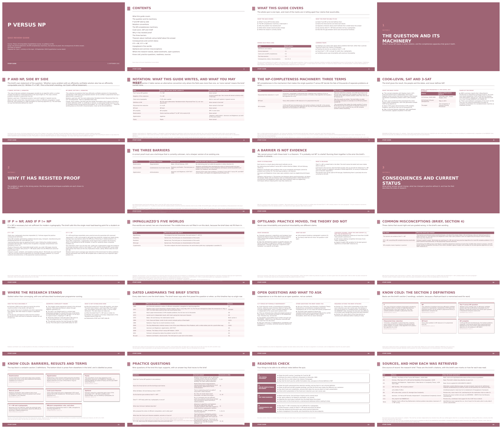

# Example outputs

Real output from this system, not mocked up and not edited afterwards. Both
artifacts below came from one subject, the P versus NP problem, run through
the pipeline described in the top-level README.

The subject matter is incidental. What these are meant to show is whether the
design decisions in the main README survive contact with a real run, so the
notes point at the evidence rather than at the content.

---

## 1. Research brief

| | |
|---|---|
| Produced by | `concept-researcher`, thorough path (`research`) |
| Files | `.md`, `.docx`, `.pdf` - the same brief in three formats |
| Connectors | Perplexity (retrieval), Firecrawl (scraping) |

**Read the `.md`.** GitHub renders it inline, so it needs no download. The
`.docx` is the pipeline's actual deliverable, built by
`concept-researcher/scripts/build_docx.py`; the `.pdf` is that same document
converted, because GitHub will not preview `.docx`.

**If you only look at one section, make it section 4, Common Misconceptions.**
It caught the two errors undergraduates actually make on this topic, that NP
stands for "non-polynomial" and that P != NP would by itself secure public-key
cryptography, and every row has to say *why* the confusion arises rather than
only that the belief is wrong. A student who learns they were wrong without
learning the cause makes the same error again.

Three other things worth noticing:

- **Section 2 is a definitions and notation table.** It exists because a brief
  read alongside a student's own course notes has to let them line the two up,
  and because this field writes the negation more than one way.
- **Section 3.2 ends in a `REQUIRED ACTION` rather than an answer.** The
  sources describe more than one standard presentation of the Cook-Levin
  reduction and the system does not know which one the reader's course uses,
  so it says so. Guessing produces a student who studied the wrong
  construction.
- **Section 7 names the sources it could not read end to end,** ordered by
  authority tier. PDFs are carried as title-and-snippet previews rather than
  scraped, so a tier 1 paper the run could not open is a real limitation and
  is reported as one.

Which sources got read at all was decided by a deterministic script,
`concept-researcher/scripts/source_tiers.py`, not by model judgment.

---

## 2. Study guide deck

| | |
|---|---|
| Produced by | `guide-generator`, both stages, from the brief above |
| Files | `.pptx` (editable), `_preview.html` (exact rendering), `_slides.png` (all 24 slides) |
| Slides | 24, across nine of the thirteen templates |

The `.pptx` is built natively by `study-guide-generator/scripts/build_pptx.py`,
with real PowerPoint text frames and tables rather than pictures of slides, so
a student can fix a definition in it. The HTML is the exact rendering, measured
for fit in headless Chromium. Where the two differ visually, the HTML is
correct.

**The slide that best shows the system working is 14, Impagliazzo's Five
Worlds.** The table names all five worlds, characterises the two the brief
actually described, and writes *"Named only. The brief gives no
characterisation of this world"* in the other three rows. Every language model
knows what Heuristica and Pessiland are. This one declined to say, because its
source did not, and a study guide that quietly fills a gap from general
knowledge is indistinguishable from one that gets it right until an exam.

The same discipline shows up elsewhere:

- **Slide 18, Dated Landmarks**, carries a row reading "No year. The brief
  gives no year and no full citation." A missing date is left missing.
- **Slide 11, A Barrier Is Not Evidence**, splits what is established from what
  is believed. The barriers are theorems about proof techniques, not evidence
  about the answer, and conflating the two is the error the slide exists to
  prevent.
- **Slide 24, Sources and How Each Was Retrieved**, carries the retrieval
  caveat from the brief into the deck, so a claim resting on a snippet preview
  is visibly different from one resting on a paper that was read.
- **Slides 5, 6 and 20** mark content taken verbatim from the brief as
  verbatim, because a definition a student memorises should not have been
  paraphrased on its way to the slide.

Nothing on any slide was written by hand, and no slide was edited after the
build.
